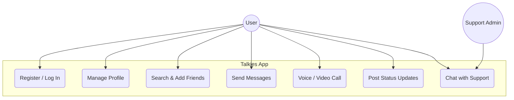
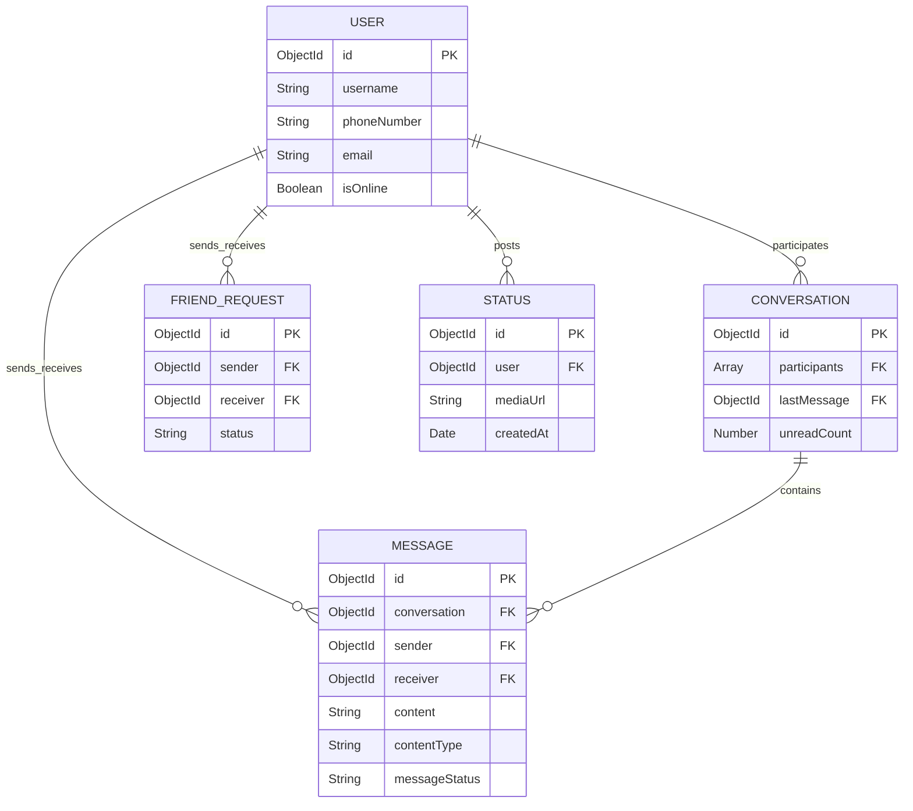
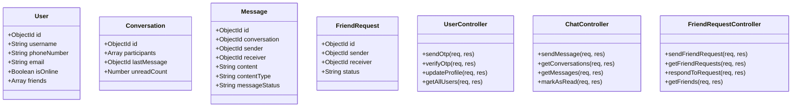

# Talkies - Exam Diagrams Reference Sheet

These three diagrams are simplified and structured so you can easily draw them by hand in your exam.

---

## 1. Use Case Diagram

Shows how the User and Support Admin interact with the system boundaries.

---

## 2. Entity-Relationship (ER) Diagram

Represents the database structure (MongoDB collections and relationships).

---

## 3. Class Diagram

Shows the structure of the data models and backend controller operations.

